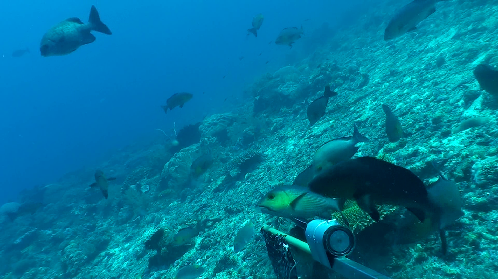

#################### Object Detection Steps ####################

### Make a new directory for the project.
cd home/
mkdir Fish
cd Fish

### Training

git clone https://github.com/zylo117/Yet-Another-EfficientDet-Pytorch.git
cd Yet-Another-EfficientDet-Pytorch

pip install pycocotools numpy==1.16.0 opencv-python tqdm tensorboard tensorboardX pyyaml webcolors matplotlib
pip install torch==1.4.0
pip install torchvision==0.5.0
pip install efficientnet_pytorch

### Make a new directory for dataset.
mkdir dataset
cd dataset
### Make a new directory for your_project_name and place the dataset in it.
mkdir Fish
cd Fish

### Place the metadata and labelled folder here.
### Place the python code csv_manipulation.py and csv_to_coco.py in the dataset directory

python csv_manipulation.py
python csv_to_coco.py
cd ..
### Adding the project file Fish.yml in projects folder
cd projects

>mv Fish.yml
			
					project_name: Fish  # also the folder name of the dataset that under data_path folder
					train_set: train
					val_set: val
					num_gpus: 1

					# mean and std in RGB order, actually this part should remain unchanged as long as your dataset is similar to coco.
					mean: [0.10027235, 0.5572759 , 0.56590959]
					std: [0.06090582, 0.1283926 , 0.14095272]

					# this is coco anchors, change it if necessary
					anchors_scales: '[2 ** 0, 2 ** (1.0 / 3.0), 2 ** (2.0 / 3.0)]'
					anchors_ratios: '[(1.0, 1.0), (1.4, 0.7), (0.7, 1.4)]'

					# must match your dataset's category_id.
					# category_id is one_indexed,
					# for example, index of 'car' here is 2, while category_id of is 3
					obj_list: ['fish']

cd ..
### Adding weights of the model
mkdir logs
cd logs
mkdir Fish
cd Fish 
> mv efficientdet-d3_31_122304.pth 
cd ../..

### Downloading pretrained weights
mkdir weights
cd weights
wget https://github.com/zylo117/Yet-Another-Efficient-Pytorch/releases/download/1.0/efficientdet-d3.pth
cd ..

### Starting the training:
# -c means efficientdet-d3 
python train.py -c 3 -p Fish --batch_size 16 --lr 1e-5 --num_epochs 10 --load_weights weights/efficientdet-d3.pth

### Training Resume
python train.py -c 3 -p Fish --batch_size 16 --lr 1e-5 --num_epochs 10 --load_weights last

### Testing on Images:
# it will load the image from  img_path and save in test folder:
python efficientdet_test_Fish_img.py img_path weight_loc efficientnet_version

python efficientdet_test_Fish_folder.py img_folder_path weight_loc efficientnet_version

### Testing on video:
# it will load the video from  vid_path:
python efficientdet_test_videos.py vid_path weight_loc efficientnet_version

#################### Classification Steps #################### 
# Make Classification dataset. Run csv_manipulation_classification.py it will create a dataset with Classif_Dataset Folder.
python csv_manipulation_classification.py

cd ..

### Make Classification Folder:
mkdir Classification
mv Yet-Another-EfficientDet-Pytorch/Classif_Dataset Classification/Classif_Dataset
cd Classification

### Train Validation Split 
python train_val_split.py

### Starting the training
python main.py Classif_Dataset

### Testing on Image:
python test.py --img_path=img_path --model_path=model_best.pth.tar

#################### Full Pipeline Steps #################### 

# Testing on image, it will save the in the same path.
python efficientdet_test_Fish.py efficientdet-d1_9_152910.pth model_best.pth.tar image_path efficientnet_version
python efficientdet_test_Fish_folder.py efficientdet-d1_9_152910.pth classification.pth.tar image_path efficientnet_version

# Testing on video, it will save the in the same path.
python efficientdet_test_Fish_video.py detection_efficientdet-d3.pth classification.pth.tar fish.mp4 efficientnet_version

